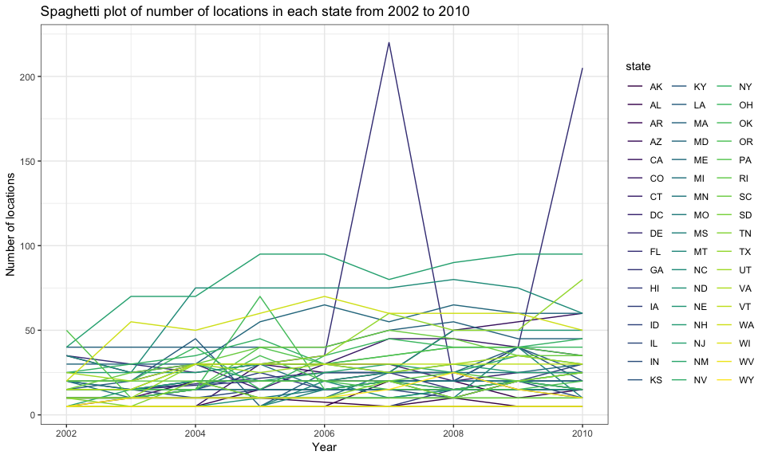
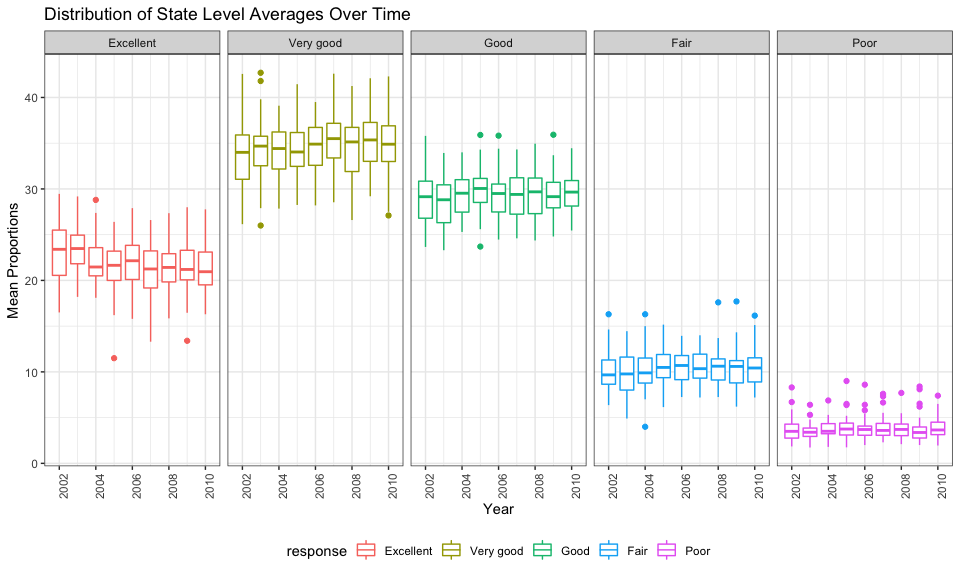
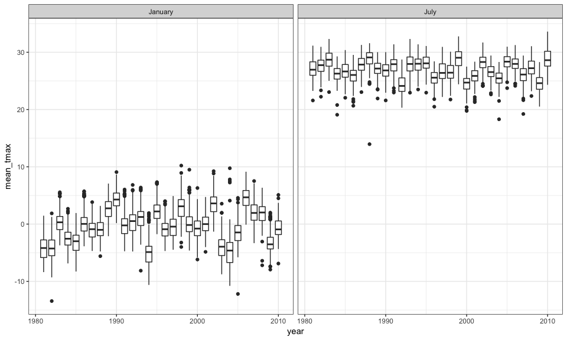
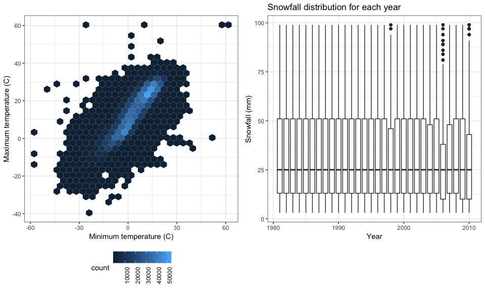

P8105\_hw3\_as5697
================
Apoorva Srinivasan
10/14/2018

Problem 1
=========

``` r
data(brfss_smart2010)
```

Data cleaning: The code chunk below cleans data based on "Overall Health" and it recodes the reponse column into a factor data type and set the levels from the "Excellent" to "Poor".

``` r
brfss = brfss_smart2010 %>% 
  janitor::clean_names() %>%
  filter(topic == "Overall Health") %>%
  filter(response %in% c("Excellent", "Very good", "Good", "Fair", "Poor")) %>% 
  rename(state = locationabbr, county = locationdesc) %>%
  mutate(response = as.factor(response)) %>% 
  mutate(
    response = fct_relevel(response, c("Excellent", "Very good", "Good", "Fair", "Poor"))
    )
```

**In 2002, which states were observed at 7 locations?**

``` r
brfss %>% 
  filter(year == 2002) %>% 
  group_by(state) %>% 
  summarize(n_locations = n_distinct(county)) %>% 
  filter(n_locations == 7) %>%
  head()
## # A tibble: 3 x 2
##   state n_locations
##   <chr>       <int>
## 1 CT              7
## 2 FL              7
## 3 NC              7
```

In 2002, the states: CT, FL and NC were observed at 7 locations.

**Make a “spaghetti plot” that shows the number of locations in each state from 2002 to 2010.**

``` r
brfss %>%
  group_by(year, state) %>%
  summarize(num_locations = n()) %>%
  ggplot(aes(x = year, y = num_locations, color = state)) + 
  labs(
    title = "Spaghetti plot of number of locations in each state from 2002 to 2010",
    x = "Year",
    y = "Number of locations") +
  geom_line() + 
  theme(legend.position = "right") +
  scale_color_viridis(discrete = TRUE) 
```



We can see that the resulting spaghetti plot is very cluttered which makes it hard to read.

**Make a table showing, for the years 2002, 2006, and 2010, the mean and standard deviation of the proportion of “Excellent” responses across locations in NY State.**

``` r
brfss %>%
  spread(key = response, value = data_value) %>%
  janitor::clean_names() %>%
  filter(year == "2002" | year == "2006" | year == "2010") %>% 
  group_by(year, state) %>%
  summarize(excellent_mean = mean(excellent, na.rm = TRUE), 
            excellent_SD = sd(excellent, na.rm = TRUE)) %>%
  filter(state == "NY") %>%
  knitr::kable(digits = 1)
```

|  year| state |  excellent\_mean|  excellent\_SD|
|-----:|:------|----------------:|--------------:|
|  2002| NY    |             24.0|            4.5|
|  2006| NY    |             22.5|            4.0|
|  2010| NY    |             22.7|            3.6|

**For each year and state, compute the average proportion in each response category (taking the average across locations in a state). Make a five-panel plot that shows, for each response category separately, the distribution of these state-level averages over time.**

``` r
brfss %>% 
  group_by(year, state, response) %>% 
  summarize(average = mean(data_value, na.rm = TRUE)) %>% 
  ggplot(aes(x = year, y = average, group = year, color = response)) + 
  geom_boxplot() + 
  facet_grid(~ response) +
  labs(title = "Distribution of State Level Averages Over Time", x = "Year", y = "Mean Proportions") +
  theme(axis.text.x = element_text(angle = 90, hjust = 1))
```



In the above five-panel plot, we show the distribution of the proportion of the five responses per year per state.

PROBLEM 2
=========

``` r
data("instacart")
  instacart = instacart %>% janitor::clean_names()
```

The dataset has 1384617 by 15 columns. The dataset contains some key variables such as aisle , department and product name. Each row is a single product from an order with key variables corresponding information on the `product_name`, `department`, grocery `aisle`, if it was `reordered`, day of the week and hour it was ordered, and the `user_id` who ordered it.There are 39123 products that were ordered by 131209 users, from 21 distinct departments.

**How many aisles are there, and which aisles are the most items ordered from?**

``` r

instacart %>%
  group_by(aisle) %>%
  summarize(order_per_aisle = n()) %>%
  arrange(desc(order_per_aisle)) %>%
  head() %>%
  knitr::kable()
```

| aisle                         |  order\_per\_aisle|
|:------------------------------|------------------:|
| fresh vegetables              |             150609|
| fresh fruits                  |             150473|
| packaged vegetables fruits    |              78493|
| yogurt                        |              55240|
| packaged cheese               |              41699|
| water seltzer sparkling water |              36617|

There are 134 distinct aisles, with the top 6 aisles being fresh vegetables, fresh fruits, packaged vegetables fruits, yogurt, packaged cheese, and water seltzer sparkling water.

**Make a plot that shows the number of items ordered in each aisle. Order aisles sensibly, and organize your plot so others can read it.**

``` r
instacart %>% 
  group_by(aisle) %>% 
  summarize(n_items = n()) %>% 
  mutate(aisle = reorder(aisle, desc(n_items))) %>% 
  ggplot(aes(x = aisle, y = n_items)) + geom_point() + labs(main = "Number of items ordered from each aisle", x = "Aisle", y = "No. of items")  + 
  theme(axis.text.x = element_text(angle = 90, hjust = 1))
```

 From the plot, we can see that fresh vegetables are maximum in number while beauty products are minimum in eahc aisle.

**Make a table showing the most popular item in each of the aisles “baking ingredients”, “dog food care”, and “packaged vegetables fruits”.**

``` r
instacart %>% 
  filter(aisle %in% c("baking ingredients", "dog food care", "packaged vegetables fruits")) %>% 
  group_by(aisle, product_name) %>% 
  summarize(n_prod = n()) %>% 
  filter(n_prod == max(n_prod)) %>% 
  knitr::kable()
```

| aisle                      | product\_name                                 |  n\_prod|
|:---------------------------|:----------------------------------------------|--------:|
| baking ingredients         | Light Brown Sugar                             |      499|
| dog food care              | Snack Sticks Chicken & Rice Recipe Dog Treats |       30|
| packaged vegetables fruits | Organic Baby Spinach                          |     9784|

Most popular products in the following aisles are:

-   baking ingredients - Light Brown Sugar

-   dog food care - Snacks Sticks Chicken and Reci Recipe Dog Treats

-   packaged vegetables fruits - Organic Baby Spinach

From these results, we can tell that customers who shop at instacart are definitely going for healthier options.

**Make a table showing the mean hour of the day at which Pink Lady Apples and Coffee Ice Cream are ordered on each day of the week; format this table for human readers (i.e. produce a 2 x 7 table).**

``` r
instacart %>%
  filter(product_name %in% c("Pink Lady Apples", "Coffee Ice Cream")) %>% 
  mutate(order_dow = ordered(order_dow, levels = c(0:6), labels = c("Sunday", "Monday", "Tuesday", "Wednesday", "Thursday", "Friday", "Saturday"))) %>% 
  group_by(product_name, order_dow) %>% 
  summarize(mean = round(mean(order_hour_of_day))) %>% 
  spread(key = order_dow, value = mean) %>% 
  knitr::kable()
```

| product\_name    |  Sunday|  Monday|  Tuesday|  Wednesday|  Thursday|  Friday|  Saturday|
|:-----------------|-------:|-------:|--------:|----------:|---------:|-------:|---------:|
| Coffee Ice Cream |      14|      14|       15|         15|        15|      12|        14|
| Pink Lady Apples |      13|      11|       12|         14|        12|      13|        12|

Sunday is taken as 0. Both coffee ice cream and pink lady apples are mostly ordered during around noon and after.

PROBLEM 3
=========

``` r
data("ny_noaa") %>%
  janitor::clean_names()
##      <NA> 
## "ny_noaa"
```

Given dataset relevant weather informations collected from all New York state weather stations from January 1, 1981 through December 31, 2010.

The dimensions of the dataset (rows, columns) are 2595176, 7. The key variables here are the weather station ID , snowfall in mm , precipitation in tenths of mm , min and max temperature in tenths of celsius.

There are 5.6195803% NAs in the precipitation column and 14.689601% NA's in the snow column and 22.8033089% NA's in the Snow depth (snwd) column and 43.7126422% NA's in the minimum temperature column and 43.7102532% NA's in the max temperature column.

As can be seen above, the issue of missing data is a real problem with our data set here since around 44% of our tmin and tmax values are missing, nearly 15% of our snowfall data is missing. This will result in incorrect analysis.

Cleaning data

``` r
ny_noaa_tidy = 
  ny_noaa %>% 
  separate(date, into = c("year", "month", "day"), sep = "-") %>% 
  mutate(month = as.integer(month), year = as.integer(year), day = as.integer(day), tmin = as.integer(tmin), tmax = as.integer(tmax)) %>% 
  mutate(month = month.name[month], tmin = tmin / 10, tmax = tmax / 10, prcp = prcp / 10) #since they're in tenths of mm/celsius 
```

**For snowfall, what are the most commonly observed values? Why?**

``` r
ny_noaa_most_snow =
  ny_noaa_tidy %>% 
  group_by(snow) %>% 
  count(snow) %>% 
  arrange(desc(n)) %>% 
  head()
```

The most commonly observed value is 0 mm, which makes sense as it does not snow for most of the year. While winter does see more snow, it stil doesn't snow enough to make a difference to our 30 yr station data.

**Make a two-panel plot showing the average max temperature in January and in July in each station across years. Is there any observable / interpretable structure? Any outliers?**

``` r
ny_noaa_tidy %>% 
  group_by(year, month, id) %>% 
  filter(month == "January" | month == "July") %>% 
  summarise(mean_tmax = mean(tmax, na.rm = TRUE)) %>% 
  ggplot(aes(x = year, y = mean_tmax, group = year)) +
  geom_boxplot() +
  facet_grid(~ month)
## Warning: Removed 5970 rows containing non-finite values (stat_boxplot).
```



``` r
  labs(
    title = "Average max temperature for Jan and July in each station across 1981 to 2010",
    x = "Year",
    y = "Average max temperature (C)"
  )
## $title
## [1] "Average max temperature for Jan and July in each station across 1981 to 2010"
## 
## $x
## [1] "Year"
## 
## $y
## [1] "Average max temperature (C)"
## 
## attr(,"class")
## [1] "labels"
```

There is a clear observable structure between the two panels from January and July. We see that the average temperature in January has had a median near 0 degree celsius all through the years 1981 to 2010 and the median of the average temperature in July is somewhere between 25 and 20 degree celsius for the month of July all through the years.

We do notice quite a few outliers. There are a few outliers near and aboe 0 degree celsius for that year. There are outlier in most of the years for January data except 1981, 1985, 1989, 1997 and 2006.

Similarly for the July datasets except for 1999, 2009 and 2010 all other years have outlier(s). Most of the outliers are similarly located around 20 degree celsius.

**Make a two-panel plot showing (i) tmax vs tmin for the full dataset (note that a scatterplot may not be the best option); and (ii) make a plot showing the distribution of snowfall values greater than 0 and less than 100 separately by year.**

``` r
tmax_vs_tmin_p = 
  ny_noaa_tidy %>% 
  ggplot((aes(x = tmin, y = tmax))) +
  geom_hex(na.rm = TRUE) +
  labs(
    tile = "Max temperature vs Min temperature", 
    x = "Minimum temperature (C)",
    y = "Maximum temperature (C)"
  ) +
  theme(legend.text = element_text(size = 9, hjust = 1, angle = 90))

snowfall_vs_year_p = 
  ny_noaa_tidy %>% 
  filter(snow > 0, snow < 100) %>% 
  ggplot(aes(x = year, y = snow, group = year)) +
  geom_boxplot(na.rm = TRUE) +
  labs(
    title = "Snowfall distribution for each year",
    x = "Year",
    y = "Snowfall (mm)"
  )

tmax_vs_tmin_p + snowfall_vs_year_p
```


