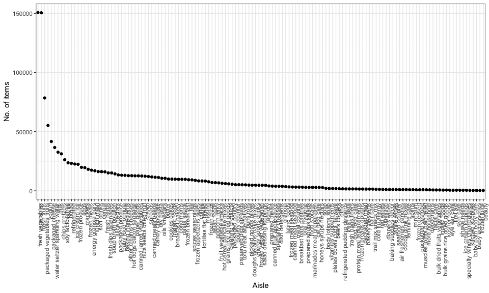

P8105\_hw3\_as5697
================
Apoorva Srinivasan
10/14/2018

Problem 1
=========

### 1.1

``` r
data(brfss_smart2010)
```

``` r
brfss = brfss_smart2010 %>% 
  janitor::clean_names() %>%
  filter(topic == "Overall Health") %>%
  filter(response %in% c("Excellent", "Very good", "Good", "Fair", "Poor")) %>% 
  rename(state = locationabbr, county = locationdesc) %>%
  mutate(response = as.factor(response)) %>% 
  mutate(
    response = fct_relevel(response, c("Excellent", "Very good", "Good", "Fair", "Poor"))
    )
```

### 1.2

In 2002, which states were observed at 7 locations?

``` r
brfss %>% 
  filter(year == 2002) %>% 
  group_by(state) %>% 
  summarize(n_locations = n_distinct(county)) %>% 
  filter(n_locations == 7) %>%
  head()
## # A tibble: 3 x 2
##   state n_locations
##   <chr>       <int>
## 1 CT              7
## 2 FL              7
## 3 NC              7
```

### 1.3

Make a “spaghetti plot” that shows the number of locations in each state from 2002 to 2010.

``` r
brfss %>%
  group_by(year, state) %>%
  summarize(num_locations = n()) %>%
  ggplot(aes(x = year, y = num_locations, color = state)) + 
  labs(
    title = "Spaghetti plot of number of locations in each state from 2002 to 2010",
    x = "Year",
    y = "Number of locations") +
  geom_line() + 
  theme(legend.position = "right") +
  scale_color_viridis(discrete = TRUE) 
```


### 1.4

Make a table showing, for the years 2002, 2006, and 2010, the mean and standard deviation of the proportion of “Excellent” responses across locations in NY State.

``` r
brfss %>%
  spread(key = response, value = data_value) %>%
  janitor::clean_names() %>%
  filter(year == "2002" | year == "2006" | year == "2010") %>% 
  group_by(year, state) %>%
  summarize(excellent_mean = mean(excellent, na.rm = TRUE), 
            excellent_SD = sd(excellent, na.rm = TRUE)) %>%
  filter(state == "NY") %>%
  knitr::kable(digits = 1)
```

|  year| state |  excellent\_mean|  excellent\_SD|
|-----:|:------|----------------:|--------------:|
|  2002| NY    |             24.0|            4.5|
|  2006| NY    |             22.5|            4.0|
|  2010| NY    |             22.7|            3.6|

### 1.5

For each year and state, compute the average proportion in each response category (taking the average across locations in a state). Make a five-panel plot that shows, for each response category separately, the distribution of these state-level averages over time.

``` r
brfss %>% 
  group_by(year, state, response) %>% 
  summarize(average = mean(data_value, na.rm = TRUE)) %>% 
  ggplot(aes(x = year, y = average, group = year, color = response)) + 
  geom_boxplot() + 
  facet_grid(~ response) +
  labs(title = "Distribution of State Level Averages Over Time", x = "Year", y = "Mean Proportions") +
  theme(axis.text.x = element_text(angle = 90, hjust = 1))
```


PROBLEM 2
=========

``` r
data("instacart")
  instacart = instacart %>% janitor::clean_names()
```

The dataset has 1384617 by 15 columns. The dataset contains some key variables such as aisle , department and product name. Each row is a single product from an order with key variables corresponding information on the `product_name`, `department`, grocery `aisle`, if it was `reordered`, day of the week and hour it was ordered, and the `user_id` who ordered it.There are 39123 products that were ordered by 131209 users, from 21 distinct departments.

How many aisles are there, and which aisles are the most items ordered from?

``` r

instacart %>%
  group_by(aisle) %>%
  summarize(order_per_aisle = n()) %>%
  arrange(desc(order_per_aisle)) %>%
  head() %>%
  knitr::kable()
```

| aisle                         |  order\_per\_aisle|
|:------------------------------|------------------:|
| fresh vegetables              |             150609|
| fresh fruits                  |             150473|
| packaged vegetables fruits    |              78493|
| yogurt                        |              55240|
| packaged cheese               |              41699|
| water seltzer sparkling water |              36617|

There are 134 distinct aisles, with the top 6 aisles being fresh vegetables, fresh fruits, packaged vegetables fruits, yogurt, packaged cheese, and water seltzer sparkling water.

Make a plot that shows the number of items ordered in each aisle. Order aisles sensibly, and organize your plot so others can read it.

``` r
instacart %>% 
  group_by(aisle) %>% 
  summarize(n_items = n()) %>% 
  mutate(aisle = reorder(aisle, desc(n_items))) %>% 
  ggplot(aes(x = aisle, y = n_items)) + geom_point() + labs(main = "Number of items ordered from each aisle", x = "Aisle", y = "No. of items")  + 
  theme(axis.text.x = element_text(angle = 90, hjust = 1))
```



Make a table showing the most popular item in each of the aisles “baking ingredients”, “dog food care”, and “packaged vegetables fruits”.

``` r
instacart %>% 
  filter(aisle %in% c("baking ingredients", "dog food care", "packaged vegetables fruits")) %>% 
  group_by(aisle, product_name) %>% 
  summarize(n_prod = n()) %>% 
  filter(n_prod == max(n_prod)) %>% 
  knitr::kable()
```

| aisle                      | product\_name                                 |  n\_prod|
|:---------------------------|:----------------------------------------------|--------:|
| baking ingredients         | Light Brown Sugar                             |      499|
| dog food care              | Snack Sticks Chicken & Rice Recipe Dog Treats |       30|
| packaged vegetables fruits | Organic Baby Spinach                          |     9784|

Make a table showing the mean hour of the day at which Pink Lady Apples and Coffee Ice Cream are ordered on each day of the week; format this table for human readers (i.e. produce a 2 x 7 table).

``` r
instacart %>%
  filter(product_name %in% c("Pink Lady Apples", "Coffee Ice Cream")) %>% 
  mutate(order_dow = ordered(order_dow, levels = c(0:6), labels = c("Sunday", "Monday", "Tuesday", "Wednesday", "Thursday", "Friday", "Saturday"))) %>% 
  group_by(product_name, order_dow) %>% 
  summarize(mean = round(mean(order_hour_of_day))) %>% 
  spread(key = order_dow, value = mean) %>% 
  knitr::kable()
```

| product\_name    |  Sunday|  Monday|  Tuesday|  Wednesday|  Thursday|  Friday|  Saturday|
|:-----------------|-------:|-------:|--------:|----------:|---------:|-------:|---------:|
| Coffee Ice Cream |      14|      14|       15|         15|        15|      12|        14|
| Pink Lady Apples |      13|      11|       12|         14|        12|      13|        12|

Sunday is taken as 0. Both coffee ice cream and pink lady apples are mostly ordered during around noon and after.

PROBLEM 3
=========

Cleaning data

``` r
data('ny_noaa')
#View(ny_noaa)
ny_noaa = 
  ny_noaa %>% 
  separate(date, into = c('year', 'month', 'date'), sep = '-') %>% 
  mutate(prcp = prcp/10, tmax = as.numeric(tmax, na.rm = TRUE)/10, tmin = as.numeric(tmin, na.rm = TRUE)/10)
```
